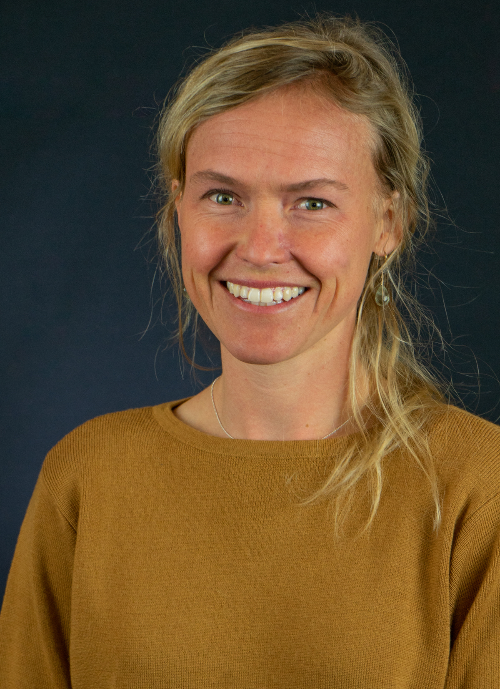

```{r setup, include=FALSE}
knitr::opts_chunk$set(echo = TRUE)
```

<div class="col-sm-4">

<br>



</div>
<div class="col-sm-6">

<br>

I was born in Wheatland, Wyoming but raised mostly in Denver, Colorado. Growing up I was fortunate to experience the best of both city and rural life. In my youth I helping on my aunt and uncles ranch, installing a life-long interested in agriculture. The interested has taken me to the mountains of southern New Mexico, to Hawaiian grasslands, the high desert of Colorado, and the plains of Wyoming. I've been fortunate to have met strong and interesting land stewards along each step of the way. Now, with a master's in agricultural economics, I hope to continue working in the agricultural space helping policy makers and producers make informed natural resource decisions. 

If you are interested in my CV click this [link](<https://www.dropbox.com/s/ogmymzl72w6nv1a/HR_Fancher_CV.pdf?dl=0>).


